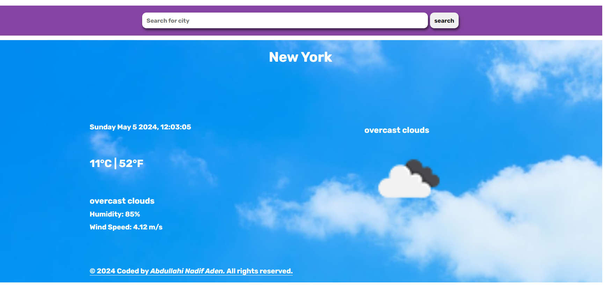

# Weather-Web-Project

This project contains a simple weather website that renders weather information for a user's searched city. It also displays an error message if the city is not recognized.

## Requirements
- Node.js

## Installation
1. Run `npm i` to install dependencies.
2. Run `nodemon server.js` to start the server.

## Usage
Visit [localhost:3000](http://localhost:3000) in your web browser to access the website. Enter a city name to view weather information.

## Functionality
- Renders weather information for a searched city.
- Displays an error message if the city is not recognized (e.g., if latitude or longitude could not be found).

## Screenshots

### Searching City

This screenshot shows the search functionality of the website, where users can enter a city name to retrieve weather information.

### Website Preview

This screenshot provides a preview of the website interface, displaying the rendered weather information for the searched city.

